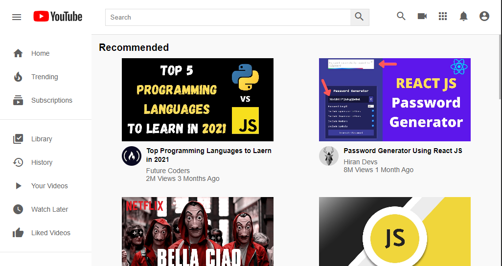
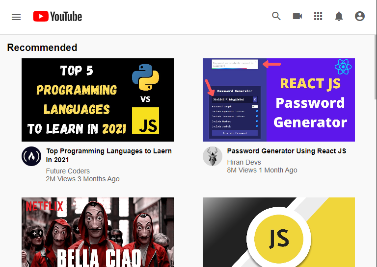
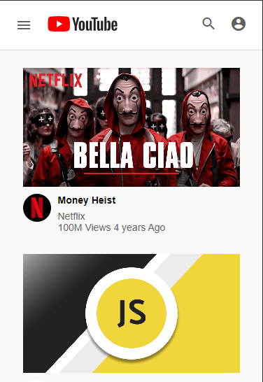

# YouTube Clone

YouTube Clone is a responsive web application that mimics the look and feel of the popular video-sharing platform, YouTube. Built using HTML and CSS, this project demonstrates modern web design techniques, responsive layouts, and modular CSS architecture.

## 🖥️ Live Demo
Check out the live version of the YouTube Clone deployed on GitHub Pages:[here](https://shubiks.github.io/YouTube-Clone/)

## View Live Demo

## 📚 Table of Contents
- [About the Project](#about-the-project)
- [Features](#features)
- [Technologies Used](#technologies-used)
- [Screenshots](#screenshots)

## About the Project
The YouTube Clone project replicates the core layout and design elements of YouTube's interface, including the header, sidebar and video thumbnails. While it doesn't include backend functionality or dynamic content, it serves as an excellent exercise in building responsive and well-structured web pages using HTML and CSS.

## Features
Header: Includes a menu icon, logo, search bar, and user interaction icons.
Sidebar: Navigation links for Home, Trending, Subscriptions, Library, History, Your Videos, Watch Later, and Liked Videos.
Video Section: Displays a grid of video thumbnails with titles, channel names, view counts, and upload dates.
Responsive Layout: Adjusts the layout for optimal viewing on desktop, tablet, and mobile devices.
Material Icons: Utilizes Google's Material Icons for consistent and visually appealing icons.

## Technologies Used
HTML5: For structuring the content.
CSS3: For styling and responsive design.
Google Material Icons: For iconography.
GitHub Pages: For deploying the live demo.

## Screenshots
| Desktop | Tablet | Mobile |
| ------- | ------ | ------ |
|  |  |  |

Happy Coding! 🚀
